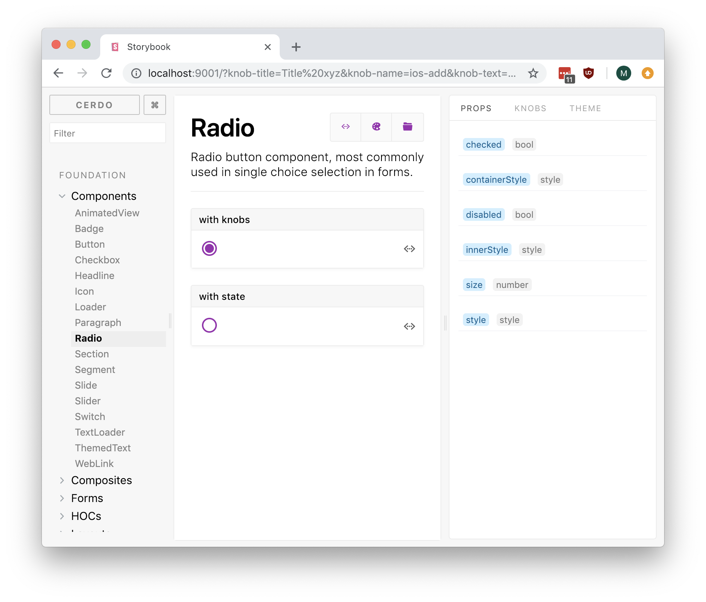

# storybook-addon-prop-types

Can be used to create better component documentation inside storybook.
Based on [React DocGen babel plugin](https://github.com/storybooks/babel-plugin-react-docgen).



## Getting started

First, intstall the addon and babel plugin.

```
npm i -D @utilitywarehouse/storybook-addon-prop-types babel-plugin-react-docgen
```

Add this line to your addons.js file (create this file inside your storybook config directory if needed).

```javascript
import '@utilitywarehouse/storybook-addon-prop-types/register'
```

Import the `withPropsOf` decorator to your stories to add propTypes content for the panel.

```javascript
import { withPropsOf } from '@utilitywarehouse/storybook-addon-prop-types'
import Radio from './Radio'
...

storiesOf('Foundation|Components', module)
  .addDecorator(withPropsOf(Radio))
  .add('Radio', () => (
    <RadioStoryOne />
  ))
```

Make sure react-docgen plugin is being used by babel. Either add it to `.babelrc` or as `--plugin react-docgen` argument to babel command.

```javascript
{
  "plugins": ["react-docgen"]
}
```

More documentation on how react-docgen works can be found in [babel-plugin-react-docgen](https://github.com/storybooks/babel-plugin-react-docgen) README.

## Caveats

1. If you use docgen plugin with production builds, it will increase the size of your bundle. Make sure to use it only for storybook.
2. React DocGen only works for propTypes defined in the same file as the component. Component needs to be the default export.
3. Wrapping component with HOC will erase docgen info, so make sure to use non-wrapped components with `withPropsOf`.
